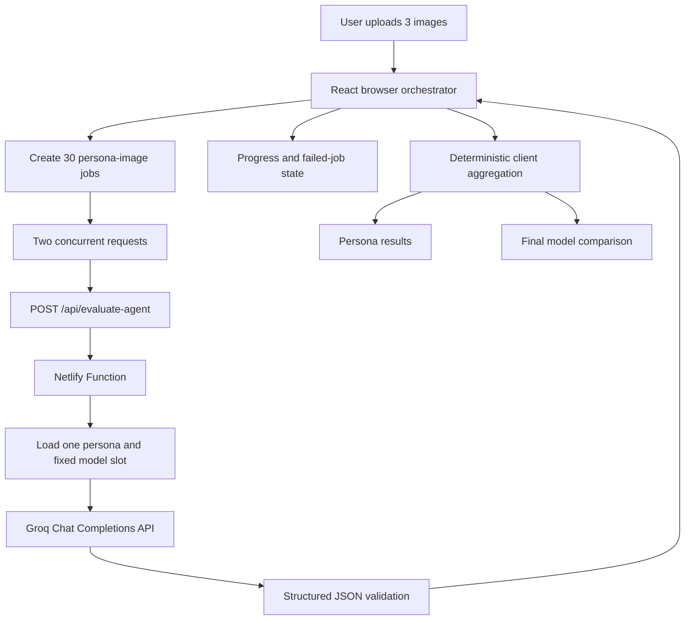

# Indian Fashion AI Evaluation — Pre-Evaluation Lab

An AI evaluation prototype for comparing premium AI-generated Indian fashion and e-commerce imagery through diverse simulated Indian persona perspectives.

The system compares three fixed model slots:

1. **GPT-Image-2.5**
2. **Nano Banana 2.1**
3. **Nano Banana Pro**

For every run, ten simulated personas independently evaluate all three images. That produces **10 × 3 = 30 individual persona-image evaluations**, followed by deterministic aggregation and a side-by-side model comparison.

> **Methodology note:** These personas are simulated analytical perspectives, not real people or statistically representative samples. They are a pre-evaluation and criteria-discovery layer. They do not replace the real Indian participants required for final human evaluation.

## Why this prototype exists

Generic image-quality comparisons do not fully answer whether an image works for Indian premium fashion commerce. This prototype looks beyond visual impressiveness and examines:

- Indian cultural authenticity without reducing India to stereotypes
- Contemporary fashion and styling
- Premium and luxury perception
- Social and lifestyle context
- Craftsmanship and garment detail
- Commercial and brand readiness
- Photorealism and AI artifacts

The product question is:

> Which image-generation model produces imagery that is visually strong, culturally appropriate, commercially useful, and relevant across diverse Indian fashion/e-commerce contexts?

## Evaluation criteria

Every persona uses the same ten criteria and weights. Persona context changes the reasoning lens, not the scoring framework.

| Criterion | Weight |
|---|---:|
| Indian Cultural Authenticity | 15% |
| Luxury & Premium Appeal | 15% |
| Fashion & Styling | 12% |
| Prompt Adherence | 12% |
| Visual Aesthetics | 10% |
| Photorealism & Authenticity | 10% |
| Indian Social Context | 8% |
| Craftsmanship & Detail | 7% |
| Commercial / Brand Readiness | 6% |
| AI Artifact Detection | 5% |
| **Total** | **100%** |

Each criterion is scored from 0–10. The weighted overall score is calculated in application code. Star ratings are derived deterministically from the aggregate score using `Math.round(score / 2)`, clamped to 0–5.

## Evaluation flow

### 1. Evaluation setup

The user uploads exactly three images. Model labels are fixed and cannot be changed:

| Image slot | Fixed model |
|---|---|
| Image 1 | GPT-Image-2.5 |
| Image 2 | Nano Banana 2.1 |
| Image 3 | Nano Banana Pro |

The browser validates PNG, JPEG, and WebP uploads and limits each image to 8 MB.

### 2. Evaluation progress

The browser creates 30 independent jobs. Each job contains one persona and one image/model. Two jobs are processed concurrently, avoiding a single long-running request for the whole run.

Each job is shown as waiting, evaluating, completed, or failed. The server-side agent function handles bounded retries for transient Groq failures:

- HTTP 429 respects `Retry-After` when available.
- Temporary 5xx and transport errors use exponential backoff with jitter.
- Retries are bounded to three retries.
- Permanent 400, 401, 403, and 404 responses are not retried indefinitely.

### 3. Persona results

The UI allows switching between the ten simulated personas. For each persona and completed image evaluation, it displays:

- Criterion scores
- Criterion reasoning
- Weighted score
- Strengths
- Concerns
- India-specific observations
- Confidence

If one job fails, successful jobs remain available and the persona is represented as partial rather than receiving fabricated scores.

### 4. Final results

After the 30 jobs settle, the browser performs deterministic aggregation and shows:

- Three images side by side
- Overall score and 5-star rating
- Rank
- Criterion breakdown
- Strengths and concerns
- Overall winner
- India-specific insights
- Common strengths and concerns
- Persona agreement/disagreement indicators

No LLM call is used to calculate final weighted scores or rankings.

## Architecture



### Frontend

The frontend is a React and TypeScript single-page application built with Vite. `src/App.tsx` owns the four-stage prototype flow:

1. Setup
2. Progress
3. Persona results
4. Final results

The browser converts selected files to data URLs for individual evaluation requests. `src/api.ts` validates response status and content type before parsing JSON, so an HTML deployment error is reported as a useful API error instead of a JSON tokenizer exception.

### Netlify Functions

The active evaluation endpoint is intentionally short-lived:

```text
POST /api/evaluate-agent
```

Netlify rewrites this to:

```text
/.netlify/functions/evaluate-agent
```

The function validates the persona ID, image ID, fixed model mapping, MIME type, and data URL before calling Groq. It returns one structured evaluation or a JSON error. It never executes all 30 evaluations in one invocation.

The repository also includes a health endpoint:

```text
GET /api/health
```

Expected response:

```json
{
  "ok": true,
  "service": "evaluation-api"
}
```

`netlify/functions/run-evaluation.ts` remains in the repository as an older server-side orchestration implementation, but it is not used by the current frontend execution path. The current production flow uses `evaluate-agent.ts` plus browser-side orchestration.

### Groq integration

Groq is called only from server-side Netlify Functions using the official Chat Completions endpoint:

```text
https://api.groq.com/openai/v1/chat/completions
```

The default configured model is:

```text
qwen/qwen3.8-27b
```

The provider requests JSON mode and validates the returned evaluation against the expected schema. The API key is read only from `GROQ_API_KEY`.

### Validation and aggregation

The server validates:

- Persona and image identity
- Fixed model mapping
- Required criterion IDs
- Criterion score range
- Reasoning presence
- Weighted score consistency
- Structured JSON shape

The client aggregation layer averages criterion scores per model, applies the fixed weights, derives star ratings, ranks available models, and preserves failed-job warnings. Missing evaluations are excluded rather than fabricated.

## API reference

### `POST /api/evaluate-agent`

Evaluates one persona against one image.

Request:

```json
{
  "personaId": "north-delhi-brand-strategist",
  "imageId": "image1",
  "modelName": "GPT-Image-2.5",
  "mimeType": "image/jpeg",
  "dataUrl": "data:image/jpeg;base64,..."
}
```

Successful response:

```json
{
  "success": true,
  "personaId": "north-delhi-brand-strategist",
  "imageId": "image1",
  "modelName": "GPT-Image-2.5",
  "evaluation": {
    "persona_id": "...",
    "persona_name": "...",
    "image_id": "image1",
    "model_name": "GPT-Image-2.5",
    "criterion_scores": {},
    "criterion_reasoning": {},
    "weighted_score": 0,
    "strengths": [],
    "concerns": [],
    "india_specific_observations": [],
    "confidence": 0
  }
}
```

Errors are JSON and may include:

- `method_not_allowed`
- `invalid_json_request`
- `invalid_evaluation_job`
- `invalid_image_data`
- `provider_model_unavailable`
- `provider_authentication_failed`
- `provider_rate_limited`
- `provider_temporarily_unavailable`
- `malformed_provider_json`
- `invalid_persona_response`

### `GET /api/health`

Returns a provider-independent deployment check. It does not call Groq and does not expose configuration or secrets.

## Technology stack

- React 18
- TypeScript
- Vite
- Netlify Functions
- Groq API
- Zod runtime validation
- `parse-multipart-data` for the legacy multipart function
- Plain CSS
- GitHub and Netlify deployment

## Local development

### Prerequisites

- Node.js with npm
- A Groq API key configured locally for server-side function execution
- Netlify CLI if using the Netlify Functions development proxy

### Install

```bash
git clone https://github.com/gptshivam595/VisualEval-MultiAgent.git
cd VisualEval-MultiAgent
npm install
```

### Configure environment variables

Copy `.env.example` to `.env` and set:

```env
GROQ_API_KEY=your_groq_api_key
GROQ_MODEL=qwen/qwen3.8-27b
```

Never commit `.env` or place the key in a `VITE_` variable. The repository ignores `.env` files and includes only the non-secret `.env.example`.

### Start the frontend

```bash
npm run dev
```

This starts Vite on its configured development port.

### Start frontend and Netlify Functions locally

```bash
npm run netlify:dev
```

This uses the Netlify configuration to proxy the frontend and Functions locally.

### Build and lint

```bash
npm run build
npm run lint
```

## Netlify deployment

The repository is configured in `netlify.toml`:

| Setting | Value |
|---|---|
| Build command | `npm run build` |
| Publish directory | `dist` |
| Functions directory | `netlify/functions` |
| Development command | `npm run dev` |
| Development target port | `5173` |
| Netlify dev port | `8888` |

To deploy:

1. Connect the GitHub repository to Netlify.
2. Use the build settings from `netlify.toml`.
3. Add `GROQ_API_KEY` in the Netlify environment variables for the deployed environment.
4. Optionally set `GROQ_MODEL`; the server falls back to the supported default if it is missing or configured to a known deprecated model.
5. Trigger a deploy after changing environment variables.
6. Verify `GET /api/health` before running a full evaluation.

The `/api/*` rewrite routes API requests to Netlify Functions before the catch-all SPA rewrite routes frontend paths to `index.html`.

## Security

- `GROQ_API_KEY` is read only in server-side code.
- The key is never included in React code or browser responses.
- Do not use `VITE_GROQ_API_KEY`.
- Do not commit `.env`.
- `.env.example` contains variable names and safe defaults only.
- Server logs contain persona/model/job metadata and provider status details, not authorization headers or API keys.
- API responses expose evaluation data and safe error codes, not provider credentials.

## Project structure

```text
.
├── docs/
│   ├── evaluation-criteria.md
│   ├── implementation-plan.md
│   ├── personas.md
│   └── ui-spec.md
├── netlify/
│   └── functions/
│       ├── evaluate-agent.ts
│       ├── health.ts
│       └── run-evaluation.ts
├── server/
│   ├── aggregate.ts
│   ├── groq-config.ts
│   ├── personas.ts
│   ├── provider.ts
│   ├── rubric.ts
│   ├── types.ts
│   └── validation.ts
├── src/
│   ├── api.ts
│   ├── App.tsx
│   ├── client-aggregate.ts
│   ├── main.tsx
│   ├── styles.css
│   └── types.ts
├── .env.example
├── .gitignore
├── index.html
├── netlify.toml
├── package.json
├── package-lock.json
├── tsconfig.app.json
├── tsconfig.json
├── tsconfig.server.json
└── vite.config.ts
```

## Documentation

- [Architecture](architecture.md)
- [Persona specifications](docs/personas.md)
- [Evaluation criteria](docs/evaluation-criteria.md)
- [UI specification](docs/ui-spec.md)
- [Implementation plan](docs/implementation-plan.md)

There is currently no `docs/agent-orchestration.md` file in the repository; the active job orchestration is documented in `architecture.md` and implemented across `src/App.tsx` and `netlify/functions/evaluate-agent.ts`.

## Limitations

- Simulated personas are not real participants and are not statistically representative of India.
- Real human evaluation is still required for the final research study.
- Three images per model/use case cannot establish broad model-level conclusions.
- Persona outputs can reflect biases or blind spots in the underlying LLM.
- The criteria and weights are a designed evaluation framework, not objective ground truth.
- Image data is held in the browser for the session and sent as data URLs to individual functions; this is suitable for a prototype, not a full media-storage architecture.
- API rate limits, image payload size, and serverless execution constraints can affect runtime.
- The current browser queue has no persistent run history or cross-device recovery.
- Agreement/disagreement summaries are lightweight indicators; they are not a formal statistical inter-rater reliability measure.

## Future improvements

Potential next steps include:

- Recruit and evaluate 8–10 real Indian participants.
- Compare human judgments with simulated persona judgments.
- Expand the image sample size and fashion categories.
- Measure inter-rater agreement and persona-human disagreement.
- Add persistent experiment history and resumable runs.
- Add statistical confidence intervals.
- Compare additional image-generation models.
- Add dedicated automated artifact detection.
- Build a reusable India-specific image-generation evaluation benchmark.

## Results and interpretation

The repository does not contain stored evaluation results or claim precomputed model performance. Users upload their own three images and run the evaluation dynamically. Any result should be interpreted as structured pre-evaluation evidence, not as a final human research finding or a universal ranking of image-generation models.

## Project status

This is a focused prototype for a product and research workflow. It is intentionally simple: a Vite frontend, short-lived Netlify Functions, server-side Groq calls, structured validation, controlled browser orchestration, and deterministic aggregation.
