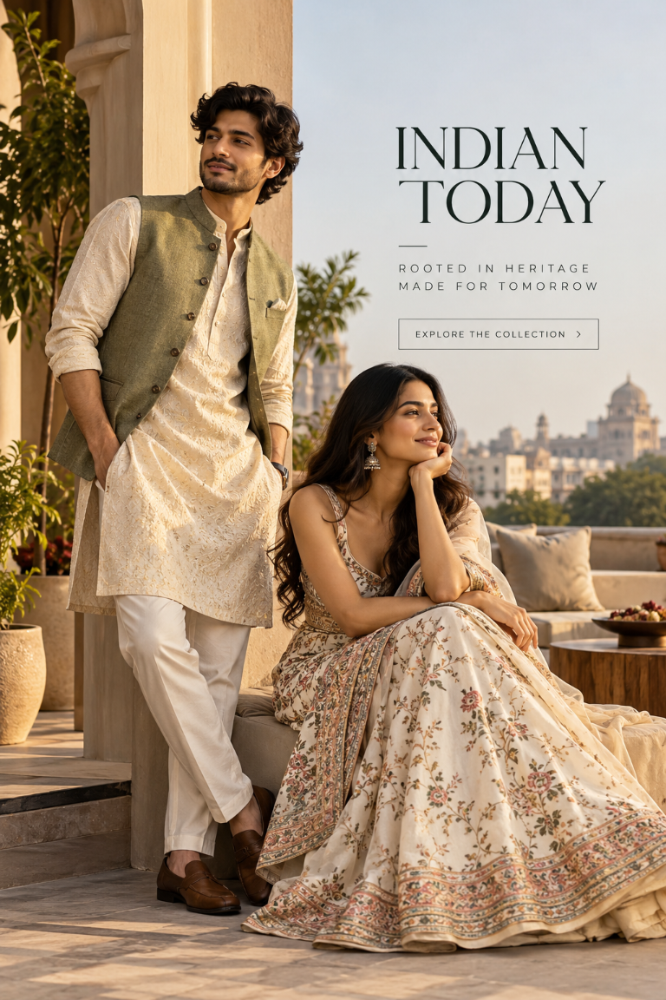
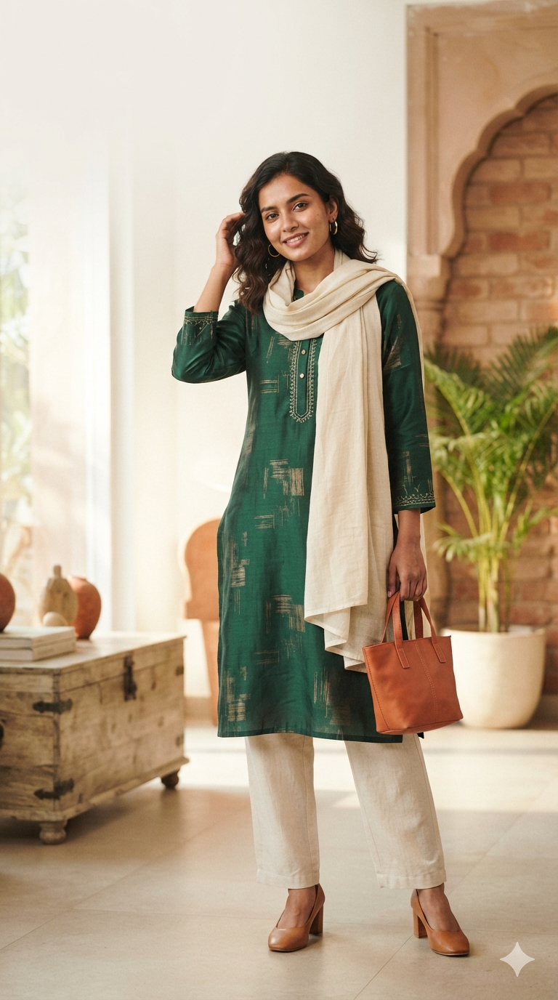
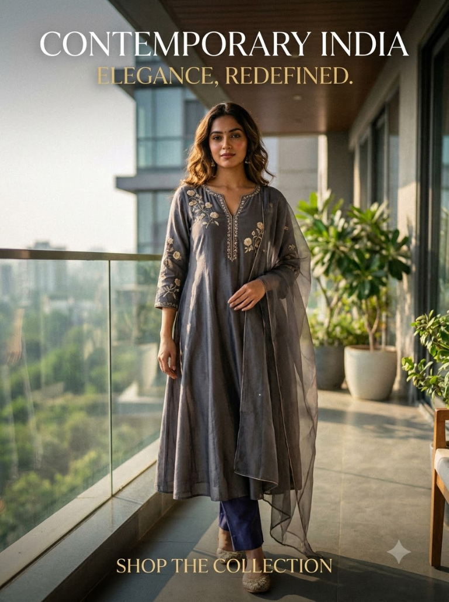
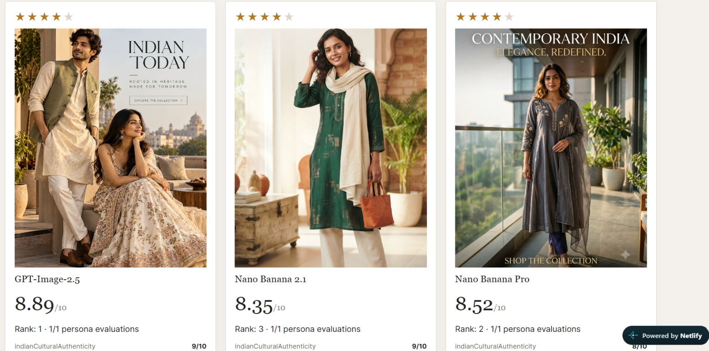
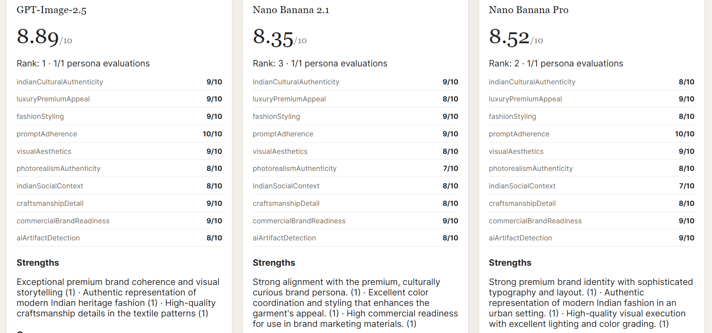
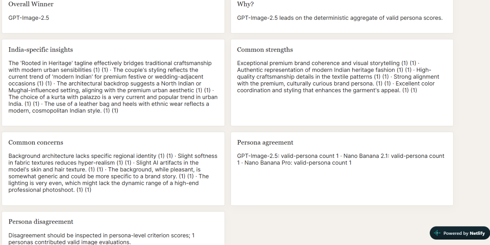

# Supporting Material — Indian Fashion AI Evaluation

This appendix provides the supplied evidence underlying the Indian fashion text-to-image evaluation. It preserves the image-generation prompt, original image outputs, prototype screenshots, participant ratings, verbatim feedback, supplied consent record, and evidence limitations.

## Contents

1. [Image-Generation Prompt](#image-generation-prompt)
2. [Original Image Outputs](#original-image-outputs)
3. [Prototype Evaluation Evidence](#prototype-evaluation-evidence)
4. [Participant Ratings](#participant-ratings)
5. [Qualitative Feedback and Evaluation Notes](#qualitative-feedback-and-evaluation-notes)
6. [Participant Consent](#participant-consent)
7. [Evidence Notes and Limitations](#evidence-notes-and-limitations)

## Image-Generation Prompt

Create a premium, photorealistic fashion e-commerce campaign poster for the Indian market, featuring a stylish Indian young adult wearing elegant contemporary Indian clothing. The outfit should feel authentically Indian while also looking modern, aspirational, sophisticated, and suitable for a premium national fashion brand.

The clothing should have refined Indian design elements inspired by India's diverse textile and fashion heritage, with tasteful craftsmanship, realistic fabric texture, natural folds, accurate draping, subtle embroidery or woven details, and high-quality tailoring. Avoid making the outfit look costume-like, stereotypical, overly traditional, or tied to one specific region unless explicitly required.

The model should have natural, realistic Indian features and appearance, with an authentic and relatable presentation rather than an exaggerated or stereotypical representation. Use a polished but believable Indian fashion-model aesthetic.

Set the scene in an elegant, contemporary Indian lifestyle environment that feels premium and aspirational while remaining culturally authentic. Incorporate subtle architectural, interior, material, or environmental cues inspired by modern India without overcrowding the composition. The setting should feel appropriate across India's diverse urban markets rather than strongly associated with only one city or region.

The overall styling should balance India's cultural heritage with contemporary fashion. It should communicate elegance, confidence, sophistication, inclusivity, and modern Indian identity. Avoid unnecessary cultural symbols, clichés, stereotypes, religious imagery, or exaggerated regional elements.

Use sophisticated editorial fashion photography with natural skin texture, realistic anatomy, accurate hands and facial features, physically plausible fabric behavior, balanced lighting, realistic shadows, and premium commercial photography quality. The composition should resemble a high-end Indian e-commerce fashion campaign rather than a generic AI-generated image.

Use a clean, premium composition with the clothing clearly visible and remaining the visual focus. Leave appropriate negative space for potential brand messaging or product information. The final image should feel suitable for a major Indian fashion e-commerce platform and appealing to customers across different regions, age groups, and cultural backgrounds in India.

The image should communicate: modern Indian fashion, cultural authenticity, premium quality, everyday aspirational lifestyle, diversity, elegance, trust, and commercial usability.

Avoid: Western-only styling, stereotypical “Indian” imagery, excessive traditional symbolism, unrealistic skin or facial features, plastic-looking skin, distorted anatomy, extra fingers, malformed hands, incorrect clothing construction, impossible fabric folds, excessive jewelry, visual clutter, exaggerated cultural elements, or an overly artificial AI aesthetic.

Create a visually compelling, commercially usable fashion poster that represents contemporary India through clothing, lifestyle, and design while remaining broadly relatable across the country.

The same supplied image-generation prompt was used for all three outputs. The images are identified as ChatGPT Image 2.5 (Image A), Nano Banana 2.1 (Image B), and Nano Banana Pro (Image C), following the order in which they were supplied for this evaluation.

## Original Image Outputs

The model-to-image mapping follows the supplied order. Model provenance is based on operator-provided identification and has not been independently authenticated.

### Image A — ChatGPT Image 2.5

*Image A — ChatGPT Image 2.5: Original fashion-campaign output supplied for evaluation.*

### Image B — Nano Banana 2.1

*Image B — Nano Banana 2.1: Original fashion-campaign output supplied for evaluation.*

### Image C — Nano Banana Pro

*Image C — Nano Banana Pro: Original fashion-campaign output supplied for evaluation.*

## Prototype Evaluation Evidence

The following supplied screenshots document visible prototype states. They are evidence of what is shown in each screenshot, not independent proof of model provenance or any action not visible in the image.

### Screenshot 1 — Comparative evaluation cards

*Prototype evaluation screenshot 1: Comparative cards for the three labelled model outputs, including displayed star ratings, images, scores, and ranks.*

### Screenshot 2 — Criterion-level score details

*Prototype evaluation screenshot 2: Visible criterion-level score lists and strengths for the three labelled model outputs.*

### Screenshot 3 — Aggregate insight panels

*Prototype evaluation screenshot 3: Visible winner, rationale, India-specific insights, common strengths, concerns, and persona-agreement panels.*

## Participant Ratings

The ratings below are the supplied overall ratings on a 1–5 scale. The total is the sum of the eight participant ratings for each image. The mean is the total divided by eight. The normalized score is the mean multiplied by two.

| Participant | Image A — ChatGPT Image 2.5 | Image B — Nano Banana 2.1 | Image C — Nano Banana Pro |
|---|---:|---:|---:|
| Prashant Seth | 5 | 3 | 4 |
| Aryan Rai | 4 | 2 | 3 |
| Manish Kumar Choudhary | 5 | 3 | 4 |
| Atul Oraon | 4 | 4 | 4 |
| Agnibha Chowdhary | 4 | 2 | 3 |
| Vivek Kumar | 4 | 4 | 3 |
| P. Anand Verma | 5 | 3 | 4 |
| Sahil Sajid | 5 | 4 | 4 |
| **Total** | **36/40** | **25/40** | **29/40** |
| **Mean rating** | **4.50/5** | **3.125/5** | **3.625/5** |
| **Normalized score** | **9.00/10** | **6.25/10** | **7.25/10** |

Eight participants rated all three images on a 1–5 scale. These are descriptive results from the participants included in this evaluation and should not be interpreted as statistically representative of the wider Indian fashion market. These participant ratings are separate from the AI weighted evaluation scores.

## Qualitative Feedback and Evaluation Notes

### Prashant Seth

> “Image Nano Banana 2.1 feels the most wearable for my age. The green kurta looks modern without losing its Indian identity. Image A is beautiful, but feels more like a wedding or luxury campaign than something I would shop for regularly.”

### Aryan Rai

> “Image ChatGPT image 2.5 has the strongest premium positioning. The coordinated outfits, architectural setting, and warm lighting create a luxury Indian fashion story. Image C is sophisticated too, but its campaign text and composition feel less polished to me.”

### Manish Kumar Choudhary

> “Image ChatGPT image 2.5 immediately reminds me of Indian weddings and festive occasions. The men's waistcoat and kurta combination is particularly strong. B and C are good for women's ethnic collections, but A tells a more complete cultural story.”

### Atul Oraon

> “I would choose nano banana 2.1 because it looks like an outfit I could actually wear to work, a family gathering, or a festival. The cream trousers and dupatta complement the green kurta. A looks expensive, while Nano banana pro feels more like a fashion editorial.”

### Agnibha Chowdhary

> “Image A communicates craftsmanship best because the embroidered kurta, waistcoat, and richly detailed lehenga work together. B has a nice understated aesthetic, but I would want a closer view of its fabric. C has an elegant silhouette, though the grey outfit communicates less festive richness.”

### Vivek Kumar

> “Image A has the best overall campaign structure. The models occupy the left and lower portions, leaving negative space for the brand message. B is useful for a product listing, but C has a clear headline and shopping message. For an actual conversion test, I would test both A and B against C.”

### P. Anand Verma

> “Image A feels most connected to Indian heritage because of its architecture, traditional silhouettes, and coordinated styling. I also like the simplicity of B. C is graceful and modern, but its setting and colour palette make it feel less distinctly Indian to me.”

### Sahil Sajid

> “Image A feels most connected to Indian heritage because of its architecture, traditional silhouettes, and coordinated styling. I also like the simplicity of B. C is graceful and modern, but its setting and colour palette make it feel less distinctly Indian to me.”

**Data-quality note:** The feedback attributed to P. Anand Verma and Sahil Sajid is identical verbatim in the supplied records. Both records are preserved as supplied. This may be a genuine matching response or a data-entry/copying error; the original responses should be checked if independent attribution matters.

## Participant Consent

The following consent statement was supplied for all eight participants:

> “I confirm that I am 18 years or older. I voluntarily participated in this evaluation. I consent to my name, email, and responses/ratings being included in this assignment submission for hiring evaluation purposes.”

The participant-to-consent mapping below records the supplied statement for each participant. The emails were available in the existing evaluation report and are reproduced here without reconstruction.

| Participant | Email | Consent record |
|---|---|---|
| Prashant Seth | btech10347.22@bitmesra.ac.in | Supplied statement above |
| Aryan Rai | btech10244.22@bitmesra.ac.in | Supplied statement above |
| Manish Kumar Choudhary | btech10168.22@bitmesra.ac.in | Supplied statement above |
| Atul Oraon | btech10152.22@bitmesra.ac.in | Supplied statement above |
| Agnibha Chowdhary | btech10243.22@bitmesra.ac.in | Supplied statement above |
| Vivek Kumar | btech10974.22@bitmesra.ac.in | Supplied statement above |
| P. Anand Verma | btech10238.22@bitmesra.ac.in | Supplied statement above |
| Sahil Sajid | btech10248.22@bitmesra.ac.in | Supplied statement above |

This is the supplied record of consent. No signatures, timestamps, signed forms, checkboxes, or separate individual consent screenshots were supplied. The appendix does not claim independent identity or consent verification.

## Evidence Notes and Limitations

1. The image-generation prompt above is the prompt supplied for all three images.
2. The image-to-model mapping follows the supplied order: A = ChatGPT Image 2.5, B = Nano Banana 2.1, C = Nano Banana Pro.
3. Model provenance has not been independently authenticated; the model names are operator-supplied labels.
4. Eight participants rated each of the three images using an overall 1–5 rating.
5. The comments are qualitative feedback, not criterion-by-criterion scores.
6. P. Anand Verma's and Sahil Sajid's supplied comments are identical and should be verified if independent responses need to be demonstrated.
7. The consent statement is reproduced from the supplied consent record; signed consent documentation was not supplied.
8. Prototype screenshots document only the states/actions visible in those screenshots.
9. No missing source files, original model metadata, or experimental settings have been invented.
